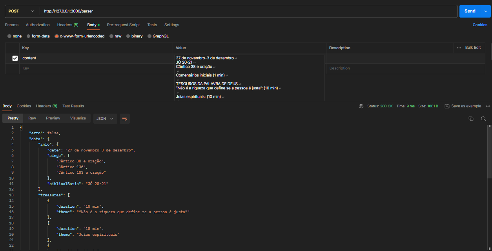

# JW Meeting Content Parser



## Baixando e execultando

```sh
git clone https://github.com/saulotarsobc/jw-content-meeting-parser.git
cd jw-content-meeting-parser
npm install
cp .env.example .env
npm run dev
```

## Build e Start

```sh
npm run build;
npm start
```

## Como usar?

> Faça uma requisição POST com o campo 'content' com o texto a seguir...

```http
POST /parser HTTP/1.1
Host: 127.0.0.1:3000
Content-Type: application/x-www-form-urlencoded
Content-Length: 2112

content="..."
```

## Resposta

```json
{
    "erro": false,
    "data": {
        "info": {
            "date": "27 de novembro–3 de dezembro",
            "sings": [
                "Cântico 38 e oração",
                "Cântico 136",
                "Cântico 103 e oração"
            ],
            "biblicalBasis": "JÓ 20-21"
        },
        "treasures": [
            {
                "duration": "10 min",
                "theme": "“Não é a riqueza que define se a pessoa é justa”"
            },
            {
                "duration": "10 min",
                "theme": "Joias espirituais"
            },
            {
                "duration": "4 min",
                "theme": "Leitura da Bíblia - Jó 20:1-22"
            }
        ],
        "yourself": [
            {
                "duration": "2 min",
                "theme": "Primeira conversa"
            },
            {
                "duration": "5 min",
                "theme": "Revisita"
            },
            {
                "duration": "5 min",
                "theme": "Discurso - Deus deseja que você seja rico?"
            }
        ],
        "linving": [
            {
                "duration": "15 min",
                "theme": "“‘Fiquem satisfeitos com as coisas que têm’”"
            },
            {
                "duration": "30 min",
                "theme": "Estudo bíblico de congregação"
            }
        ]
    }
}
```

### Content modelo

```txt
27 de novembro–3 de dezembro
JÓ 20-21
Cântico 38 e oração

Comentários iniciais (1 min)

TESOUROS DA PALAVRA DE DEUS
“Não é a riqueza que define se a pessoa é justa”: (10 min)

Joias espirituais: (10 min)

Jó 20:2 — Como os anciãos podem ajudar aqueles que lidam com “pensamentos inquietantes”? (w95 1/1 9 § 19)

Sua resposta
Na leitura da semana, que joia espiritual você encontrou sobre Jeová, sobre a pregação ou sobre outro assunto?

Sua resposta
Leitura da Bíblia: (4 min) Jó 20:1-22 (th 5)

FAÇA SEU MELHOR NO MINISTÉRIO
Primeira conversa: (2 min) Use o assunto que aparece em “Conversas sobre a Bíblia”. (th 1)

Revisita: (5 min) Use o assunto que aparece em “Conversas sobre a Bíblia”. Ofereça a brochura Seja Feliz para Sempre! e demonstre como é um estudo bíblico. (th 6)

Discurso: (5 min) g 5/09 12-13 — Tema: Deus deseja que você seja rico? (th 17)

NOSSA VIDA CRISTÃ
Cântico 136

“‘Fiquem satisfeitos com as coisas que têm’”: (15 min) Discurso, com algumas participações da assistência, e vídeo.

Estudo bíblico de congregação: (30 min) bt cap. 2 §§ 16-23

Comentários finais (3 min)

Cântico 103 e oração
```

## Exemplo usando fetch(javascript)

```js
var myHeaders = new Headers();
myHeaders.append("Content-Type", "application/x-www-form-urlencoded");

var urlencoded = new URLSearchParams();
urlencoded.append("content", "11-17 de dezembro\nJÓ 25-27\nCântico 34 e oração\n\nComentários iniciais (1 min)\n\nTESOUROS DA PALAVRA DE DEUS\n“A integridade não exige perfeição”: (10 min)\n\nJoias espirituais: (10 min)\n\nJó 26:14 — Apesar de sabermos muito pouco sobre a criação, o que isso nos faz entender sobre Jeová? (w16.11 9 § 3)\n\nSua resposta\nNa leitura da semana, que joia espiritual você encontrou sobre Jeová, sobre a pregação ou sobre outro assunto?\n\nLeitura da Bíblia: (4 min) Jó 25:1–26:14 (th 12)\n\nFAÇA SEU MELHOR NO MINISTÉRIO\nPrimeira conversa: (2 min) Use o assunto que aparece em “Conversas sobre a Bíblia”. O morador corta a conversa de um jeito comum em seu território. Mostre como responder. (th 1)\n\nRevisita: (5 min) Use o assunto que aparece em “Conversas sobre a Bíblia”. Mostre para a pessoa como encontrar no jw.org informações que sejam do interesse dela. (th 17)\n\nEstudo bíblico: (5 min) lff lição 13 introdução e pontos 1-3 (th 15)\n\nNOSSA VIDA CRISTÃ\nCântico 45\n\n“A integridade e os nossos pensamentos”: (5 min) Discurso, com algumas participações da assistência.\n\nRealizações da organização: (10 min) Mostre o vídeo Realizações da Organização do mês de dezembro.\n\nEstudo bíblico de congregação: (30 min) bt cap. 3 §§ 4-11\n\nComentários finais (3 min)\n\nCântico 57 e oração");

var requestOptions = {
  method: 'POST',
  headers: myHeaders,
  body: urlencoded,
  redirect: 'follow'
};

fetch("http://127.0.0.1:3000/parser", requestOptions)
  .then(response => response.text())
  .then(result => console.log(result))
  .catch(error => console.log('error', error));
```
